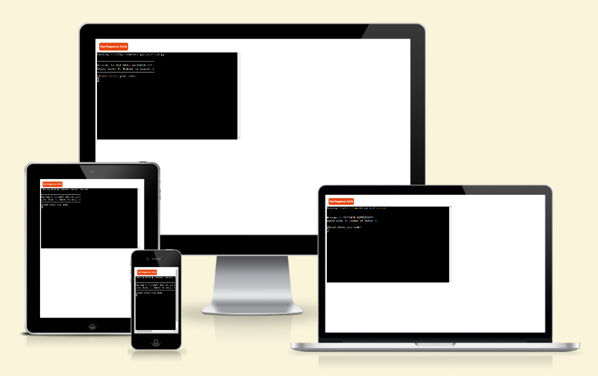
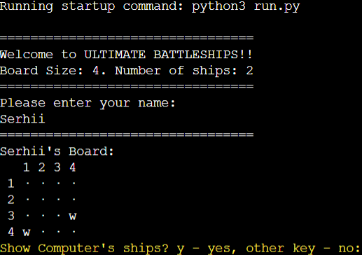
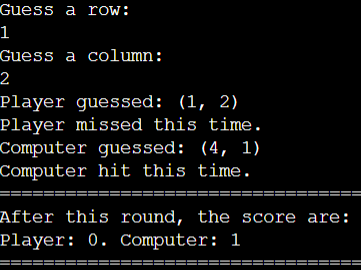
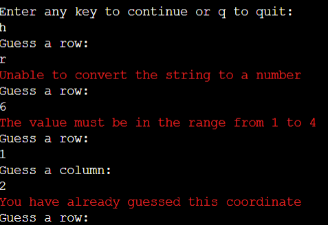
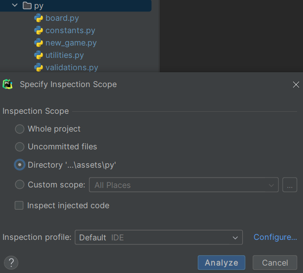
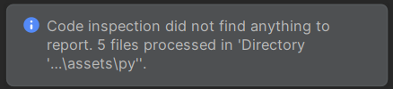

# ULTIMATE Battleships

Ultimate Battleships is a Python terminal game, whick runs in the Code Institute mock terminal on Heroku

Users can try beat the computer by finding all of the computer's battleships before the computer finds theirs. Each battleship occupies one square on the board.

[Here is the live version of my project.](https://pp3-battle-ship-ca770c61df83.herokuapp.com)

## How to play

Ultimate Battleships is based on the classic pen-and-paper game.

In this version, the player enters their name and two boards are randomly generated.

The player can see where their ships are, indicated by a 'w' letter. In my version I implemented feature to see Computer's ships for testing purposes.

Guesses are marked on the board with ascii-symbol 164 colored in blue. Hits are indicated by X colored in red.

The player and the computer then take it in turns to make guesses and try to sink each other's battelships.

The winner is the player who sinks all of their opponent's battleships first.

## Features

### Existing Features

- Random board generation
  - Ships are randomly placed on both the player and computer boards
  - There is an option to switch on to see computer's ships to check that after winning the game is finished correctly.

- Play against the computer
- Accept user input
- Maintains scores

- Input validation and error-checking
  - You cannot enter coordinates outside the size of the grid
  - You must enter numbers
  - You cannot enter the same guess twice

- Data maintained in class instances

## Future Features

- Allow player to select the board size and number of ships
- Allow player to position ship's themselves
- Have ships larger than 1x1

## Data Model

I decided to use a Boar class as my model. Then two child classes are inherited from this class, each of which has its own specifics, but the names of the methods of the heirs are the same as those of the parent class. The game creates two instances of the child's classes to hold the player's and computer's board.

The parent class stores grid and the player name. Information about ships, where they are plaсed, hits, misses is stored in the grid, and is agregated on fly when it is nessesary.

The parent class also has methods to help play the game, such as print_board method to print out the current board, an add_random_ships method to add ships to the board.

## Testing

I have manually tested this project by doing the following:

- Passed the code through a PEP8 linter and confirmed there no problems
- Given invalid inputs: strings when numbers are expected, out of bounds inputs, same input twice
- Tested in my local terminal and the Code Institute Heroku terminal

## Remaining Bugs

- No bugs remaining

### Validator Testing

- PEP8
  - I used PyCharm for code inspection
  

  
  - There were not find any issues in my code
  
  

## Deployment

This project was deployed using Code Institute's mock terminal for Heroku.

- Steps for deployment:
  - Fork or clone this repository
  - Create a new Heroku app
  - Set the buildbacks to Python and NodeJS in that order
  - Link the Heroku app to the repository
  - Click on Deploy
